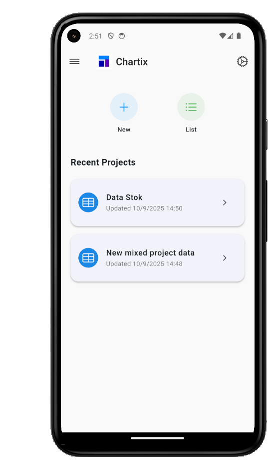
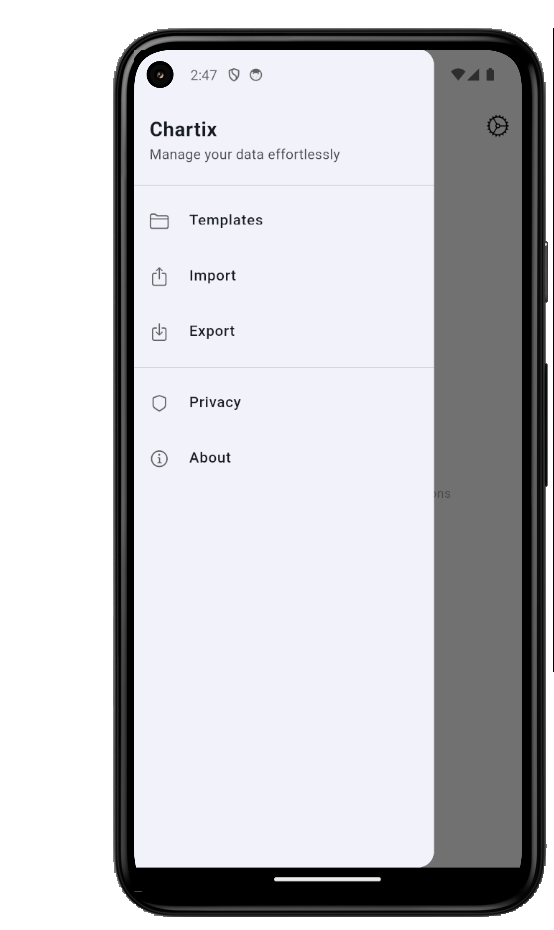
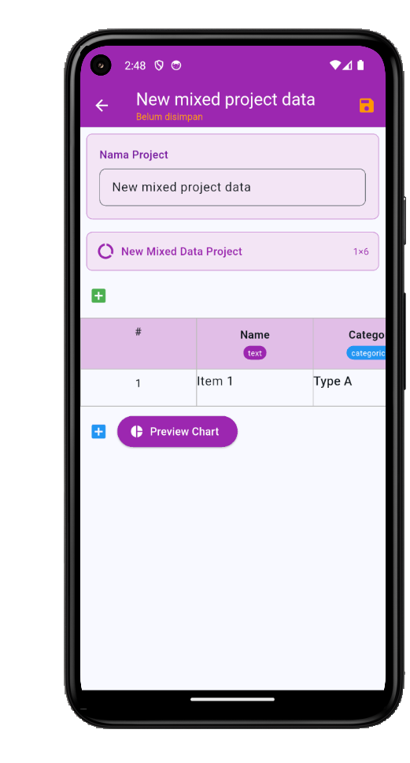
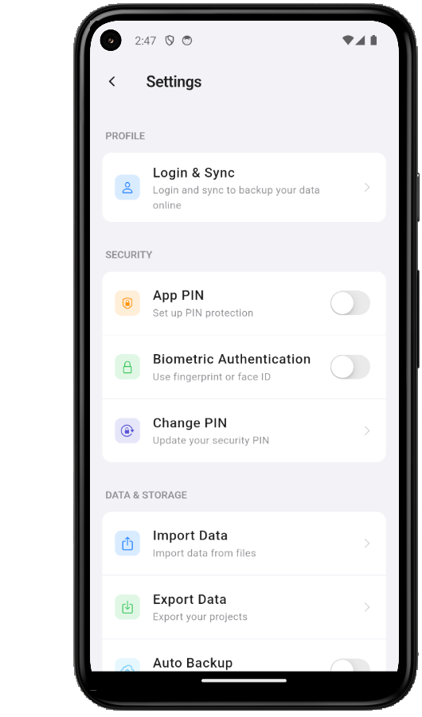
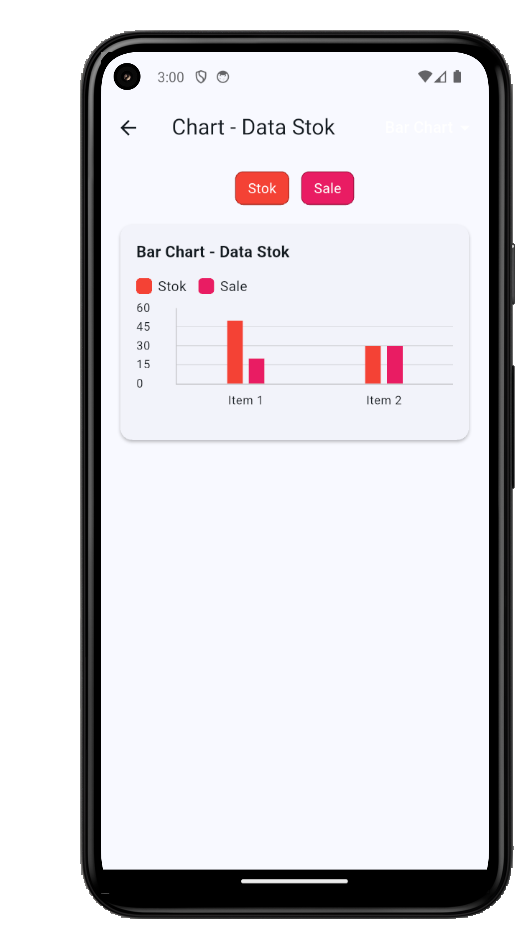

# Chartix

Chartix is a lightweight data management and visualization app.
It allows users to create, edit, organize, and visualize datasets with flexible tools such as charts, import/export, and project management.

---

## App Screenshots

### Dashboard



* Central view with:

  * Data input form
  * Data list preview

---

### Menu



* Contains shortcuts to:

  * Templates
  * Import
  * Export
  * About section

---

### Make Data



* Create a new dataset from scratch
* Define column names and types
* Add rows of data

---

### Edit Data


* Modify an existing dataset
* Edit dataset name
* Change column names and types
* Update values

---

### Project List


* Displays all saved projects
* Open, edit, or remove datasets
* Organize multiple projects

---

### Settings



* Manage application preferences:

  * Pin application
  * Import and export data
  * Sign in / log in for sync

---

### Chart



* Visualize data in chart form
* Change chart types (bar, line, pie, etc.)
* Edit chart colors and styles

---

## Key Features

* **Data Management**: Create, edit, and delete datasets with custom columns and types.
* **Import/Export**: Support for common file formats.
* **Project Handling**: Save and manage multiple datasets as projects.
* **Visualization**: Switch between chart types and customize chart colors.
* **Templates**: Start from predefined data structures.
* **Settings**: Pin app, manage imports/exports, and account login.

---

## Getting Started

```bash
git clone https://github.com/username/chartix.git
cd chartix
npm install
npx expo start
```

---


---

## Roadmap

* Advanced chart customization (legends, labels, themes)
* Cloud sync for projects
* Collaboration features
* Export charts as images or PDFs

---

## License

MIT License
